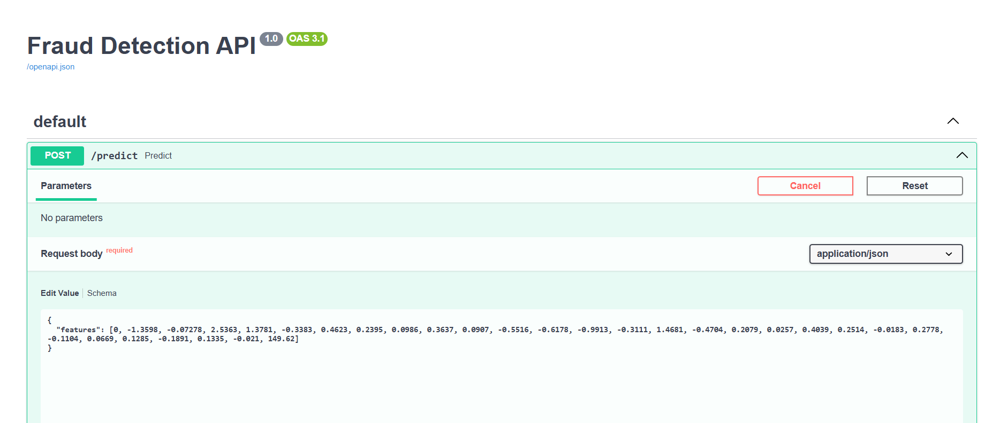
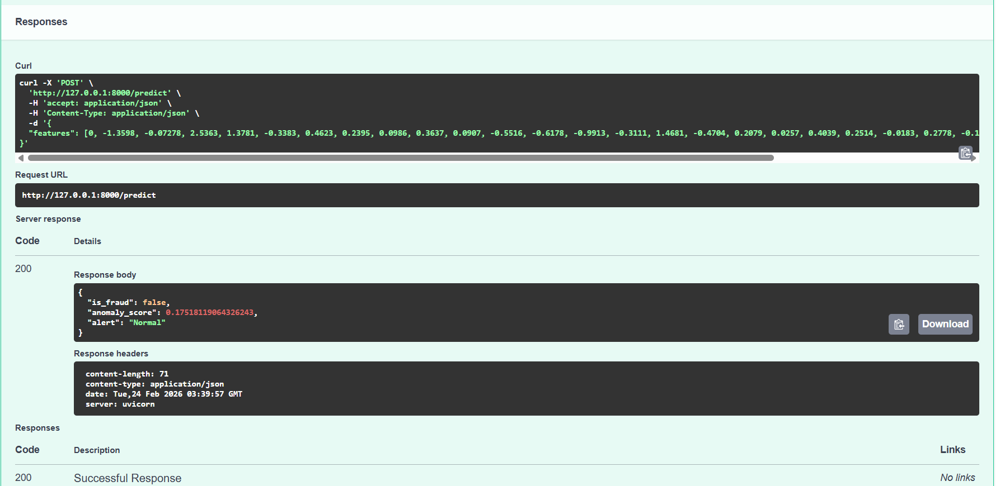
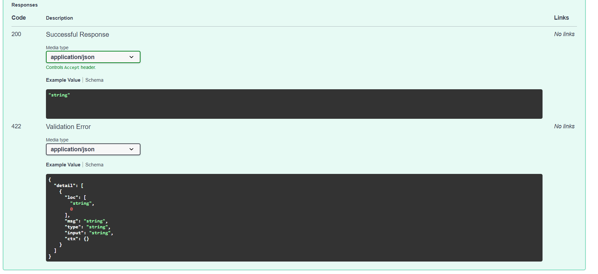
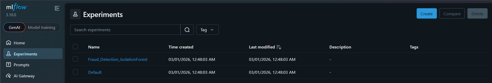
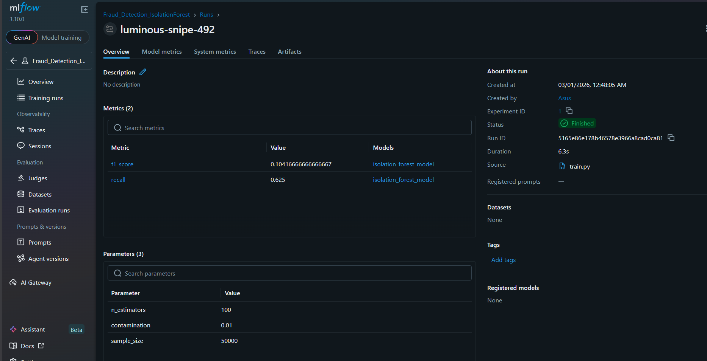

# MLOps Final Project: Credit Card Fraud Detection API

**Estudiante:** Ricardo Bautista  
**Curso:** MLOps - Maestría en Data Science (UNI)  
**Ciclo:** 3 (2026)  

---

## 📌 1. Descripción del Problema
El fraude con tarjetas de crédito representa pérdidas millonarias para el sector financiero. El objetivo de este proyecto es desarrollar una solución *end-to-end* basada en Machine Learning para detectar transacciones fraudulentas en tiempo real, emitiendo alertas automatizadas.

Dada la naturaleza transaccional y el extremo desbalanceo de clases (los fraudes representan una fracción minúscula del volumen total), se optó por un enfoque de **Detección de Anomalías** utilizando el algoritmo no supervisado **Isolation Forest**. Este enfoque permite identificar patrones atípicos asumiendo que el fraude se comporta como una rareza estadística en el espacio de características.

---

## 📊 2. Dataset y Variables (Features)
Se utilizó el dataset público *Credit Card Fraud Detection* de Kaggle.
* **Volumen:** 284,807 transacciones totales (Muestra de 50,000 para el desarrollo del pipeline local).
* **Desbalanceo:** Fraudes representan solo el 0.172% del total.
* **Variables (30 predictoras):**
  * `Time`: Segundos transcurridos entre transacciones.
  * `V1` a `V28`: Componentes principales (PCA) anonimizadas por políticas de confidencialidad bancaria.
  * `Amount`: Monto de la transacción.
  * `Class`: Variable objetivo (0 = Normal, 1 = Fraude). *Nota: En el pipeline, esta etiqueta solo se utilizó en la fase de inferencia para validar el rendimiento del modelo, preservando la naturaleza no supervisada del entrenamiento.*

---

## ⚙️ 3. Preparación de Datos y Experimentación
Siguiendo las fases del **ML Lifecycle**:
1. **Data Split:** División en 80% entrenamiento (`X_train`) y 20% evaluación (`X_test`).
2. **Model Training:** Se entrenó el Isolation Forest configurando el hiperparámetro `contamination=0.01` (basado en la tasa de anomalías esperada para forzar al modelo a aislar el 1% de los datos más atípicos).
3. **Model Packaging:** Utilizando la librería `joblib`, se serializó el modelo resultante (`isolation_forest_fraud.pkl`) para asegurar la reproducibilidad y el despliegue.

---

## 🚀 4. Arquitectura y Desarrollo MLOps
El proyecto transiciona de un entorno analítico puro (Notebooks) a una estructura de software modular preparada para producción:

```text
uni_mds_ciclo3_ml_project/
├── data/raw/               # Dataset crudo (creditcard.csv)
├── models/                 # Modelos serializados (.pkl)
├── src/                    
│   ├── train.py            # Lógica de entrenamiento y empaquetado
│   └── serving.py          # Definición de la API REST
├── Dockerfile              # Configuración de contenedorización
├── requirements.txt        # Dependencias del entorno
└── README.md               # Documentación
```

**Ejecución del Entrenamiento:**
```bash
python src/train.py
```

---

## 📡 5. Model Serving e Inferencia
El modelo se desplegó como una **API RESTful** utilizando **FastAPI**. Se implementó validación robusta de datos de entrada a través de **Pydantic**, garantizando que el endpoint `/predict` reciba un vector numérico exacto de 30 dimensiones, mitigando errores de tipado en inferencia.

**Levantar el servidor local (Uvicorn):**
```bash
uvicorn src.serving:app --reload
```

**Evidencia de Predicción:**






---

## 💡 6. Evaluación, Métricas y Business Insights

Al evaluar el modelo Isolation Forest contra las etiquetas reales (`y_test`), obtuvimos las siguientes métricas clave:
* **Recall (Sensibilidad) - Clase 1 (Fraude):** ~0.62
* **Precision - Clase 1 (Fraude):** ~0.06
* **F1-Score:** ~0.10

### Justificación Analítica de las Métricas:
A simple vista, un F1-Score de 0.10 podría parecer deficiente, pero en el contexto de **prevención de fraude transaccional con modelos no supervisados**, tiene una justificación clara:

1. **El valor del Recall (62%):** En el sector financiero, el costo de un *Falso Negativo* (dejar pasar un fraude real) es altísimo. El modelo logró aislar e identificar el 62% del fraude real basándose puramente en la rareza estadística de las transacciones, sin haber visto una sola etiqueta durante el entrenamiento. Es un comportamiento excelente para un baseline no supervisado.
2. **El impacto en Precision (6%):** Al buscar anomalías, el Isolation Forest marca como atípica cualquier transacción estadísticamente rara. Estas transacciones son reales y legales, pero "raras", lo que el modelo clasifica como fraude, disparando los *Falsos Positivos* y reduciendo la métrica de Precisión.
3. **Insight de Negocio:** Este modelo actuaría perfectamente como una **primera capa de defensa (filtro grueso)** en un pipeline de monitoreo. Su objetivo no es ser el decisor final, sino reducir el universo de millones de transacciones a un pequeño subconjunto de "alertas" que luego pueden ser pasadas a revisión manual por analistas.

---

## 🚀 7. Prácticas Avanzadas MLOps Implementadas (Puntos Extra)
Para elevar la madurez del proyecto, se implementaron las siguientes herramientas de la industria:

1. **Experiment Tracking y Model Registry (MLflow):** Se integró `mlflow` en el script de entrenamiento (`train.py`). Esto permite registrar automáticamente los hiperparámetros (`contamination=0.01`), métricas de evaluación (`F1`, `Recall`) y serializar el modelo como un artefacto versionado, garantizando la reproducibilidad exacta del experimento.
   
   *Evidencia del Tracking:*
   
   

2. **Containerization (Docker):** Se construyó un `Dockerfile` en la raíz del proyecto. Este archivo empaqueta la aplicación web (FastAPI), el modelo serializado y las dependencias en una imagen ligera basada en `python:3.10-slim`, dejando el proyecto listo para ser desplegado en la nube.

---

## 🎓 8. Lecciones Aprendidas
* **Version Control en MLOps:** El uso de ramas y *Pull Requests* hacia `main` es vital para proteger el código productivo.
* **Contratos de Inferencia:** Definir esquemas estrictos de entrada con Pydantic es un paso fundamental para evitar caídas silenciosas en producción.